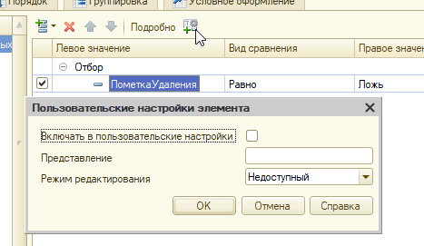

# Задание к занятию «Форма списка»

*Примерное время выполнения: 20–60 минут*

## Цель задания

1. Научиться работать с формами списков и выбора.
2. Разобраться с настройками динамического списка.
3. Подготовить конфигурацию к последующей работе.

## Чеклист готовности к домашнему заданию

- [ ] Установить учебную платформу версии 8.3.22 или больше.
- [ ] Подготовить разработанную ранее конфигурацию "УправлениеИТФирмой"
- [ ] Просмотреть материал занятия «Ссылочные типы».

## Инструкция к заданию

1. Решите описанные задачи в конфигураторе.
2. Протестируйте решение в пользовательском режиме, обязательно введите данные в базу, убедитесь, что все работает.
3. Отправьте на проверку в личном кабинете Нетологии один общий файл базы данных (.dt), содержащей решение всех задач.

## Задача 1. Видимость помеченных на удаление элементов списка

### Описание задачи

Скрыть помеченных на удаление контрагентов, дав возможность показать их по команде в подменю «Ещё».

### Процесс выполнения

1. Создайте элемент стиля ШрифтПомеченныхНаУдаление (зачёркнутый) и/или ЦветПомеченныхНаУдаление (серый).
2. В настройках условного оформления динамического списка контрагентов добавьте условие на пометку удаления, применив стиль ко всей строке.
  * В конфигураторе откройте форму списка справочника Контрагенты
  * Перейдите в настройки Динамического списка, в раздел "Условное оформление"
  * Добавьте строку в настройку условного оформления. В ней
    + В колонке "Оформление" установите шрифт - ШрифтПомеченныхНаУдаление, цвет шрифта - ЦветПомеченныхНаУдаление
    + В колонке Условие - задайте Отбор ПометкаУдаления = Истина
    + Оформляемые поля оставьте незаполненной
3. Зайдите в режим предприятия, пометьте одного контрагента на удаление, убедитесь, что для него установилось оформление, согласно правилам.
4. В отборе динамического списка установите отбор по умолчанию ПометкаУдаления — Равно — Ложь. 

  
Важно

  Флажок «Включать в пользовательские настройки» для этого элемента нужно снять. Затем, открыть «Свойства элемента пользовательских настроек» и установить режим редактирования «Недоступный»
  

   

5. Создайте в форме реквизит ПоказыватьПомеченныхНаУдаление с типом Булево. На форму реквизит выносить не нужно.
6. Создайте команду ПоказыватьПомеченныхНаУдаление. 
7. Вынесете команду на форму в командную панель формы. В свойствах кнопки установите ПоложениеВКоманднойПанели = В дополнительном подменю. Так, команда пропадет с формы, но будет доступна в подменю "Еще".
8. В обработчике команды:
  * инвертировать реквизит ПоказыватьПомеченныхНаУдаление (т.е. поменять значение на противоположное)
  * установить пометку кнопки согласно новому значению реквизита
  * элемент отбора нужно найти в составе коллекции Список.КомпоновщикНастроек.Настройки.Отбор.Элементы по равенству свойства ЛевоеЗначение полю компоновки данных «ПометкаУдаления»
  * в случае отсутствия такого элемента его нужно создать
  * правым значением элемента отбора будет Ложь, видом сравнения — равно, а Использование будет зависеть от значения реквизита формы ПоказыватьПомеченныхНаУдаление

  
Код

  &НаКлиенте
	Процедура ПоказыватьПомеченныхНаУдаление(Команда)   
	
		ПоказыватьПомеченныхНаУдаление = Не ПоказыватьПомеченныхНаУдаление;
		Элементы.ФормаПоказыватьПомеченныхНаУдаление.Пометка = ПоказыватьПомеченныхНаУдаление;
	
		ПолеПометкаУдаления = Новый ПолеКомпоновкиДанных("ПометкаУдаления");
		НайденныйЭлементОтбора = Неопределено;
		ЭлементыОтбора = Список.КомпоновщикНастроек.Настройки.Отбор.Элементы;
		Для Каждого ЭлементОтбора Из ЭлементыОтбора Цикл
			Если ЭлементОтбора.ЛевоеЗначение = ПолеПометкаУдаления Тогда
				НайденныйЭлементОтбора = ЭлементОтбора;
				Прервать;
			КонецЕсли;
		КонецЦикла;
	
		Если НайденныйЭлементОтбора = Неопределено Тогда
			НайденныйЭлементОтбора = ЭлементыОтбора.Добавить(Тип("ЭлементОтбораКомпоновкиДанных"));
			НайденныйЭлементОтбора.ЛевоеЗначение = ПолеПометкаУдаления;
		КонецЕсли;
	
		НайденныйЭлементОтбора.ВидСравнения = ВидСравненияКомпоновкиДанных.Равно;
	  НайденныйЭлементОтбора.ПравоеЗначение = Ложь;
  	НайденныйЭлементОтбора.Использование = Не ПоказыватьПомеченныхНаУдаление;
	
  КонецПроцедуры

## Задача 2. Подбор программ в форму контрагента

### Описание задачи

### Процесс выполнения

## Задача 3. Добавить в форму списка подсветку зелёным строк «Поступление товаров и услуг» и «Реализация товаров и услуг»

### Описание задачи

### Процесс выполнения

## Пример
[Пример выполнения домашнего задания](examples/HW_4_5_example.md)

## Критерии оценки

Зачёт ставится, если:
1. Программа запускается, не возникает явных ошибок, исключений при выполнении программы (в том числе, если Вы начали делать дополнительную задачу, ее функционал не должен приводить к ошибкам и исключениям)
2. Помеченные на удаление контрагенты выделяются серым цветом и/или зачеркнутым шрифтом и скрыты по умолчанию.
3. В «Ещё» есть команда «Показывать помеченных на удаление», выбор которой переключает пометку и управляет видимостью помеченных на удаление.
4. К справочнику «Контрагенты» добавлена табличная часть «Программы» с реквизитом «Программа» типа СправочникСсылка.Номенклатура.
5. В форме контрагента есть таблица «Программы» с кнопкой «Подбор» в командной панели, открывающая форму выбора справочника «Номенклатура» в режиме подбора. Результат подбора не должен содержать дублей программ.
6. Зелёным подсвечиваются документы «Реализация» с суммой выше 100 000 рублей.
7. Красным подсвечиваются документы «Поступления» с суммой выше 100 000 рублей.
8. Введены тестовые данные

Все задачи обязательны к выполнению (кроме текста под спойлером "Дополнительно" - эти задачи делать не обязательно. Возможно, Вы вернетесь к ним позднее, после того, как изучите дополнительный материал).

Пожалуйста, присылайте на проверку все задачи сразу, одним файлом выгрузки информационной базы (dt)

Любые вопросы по решению задач задавайте в чате учебной группы.
