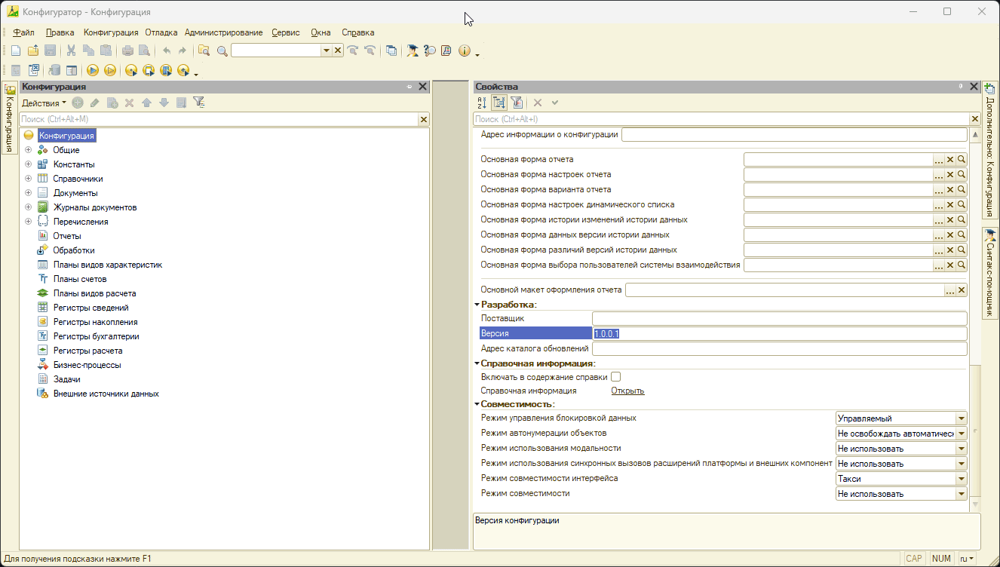
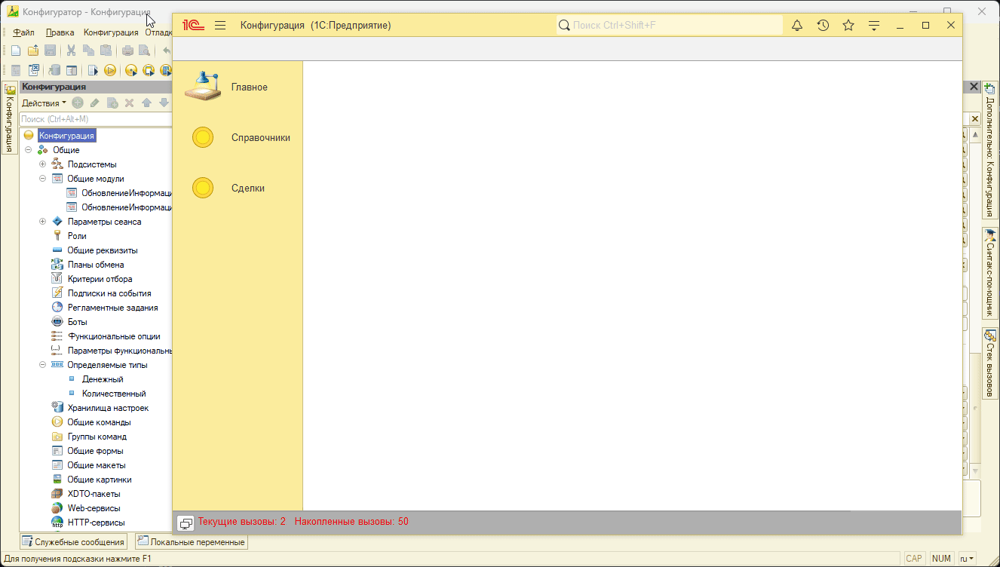
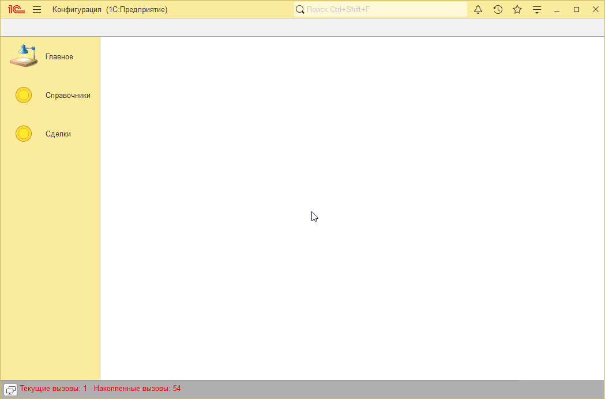
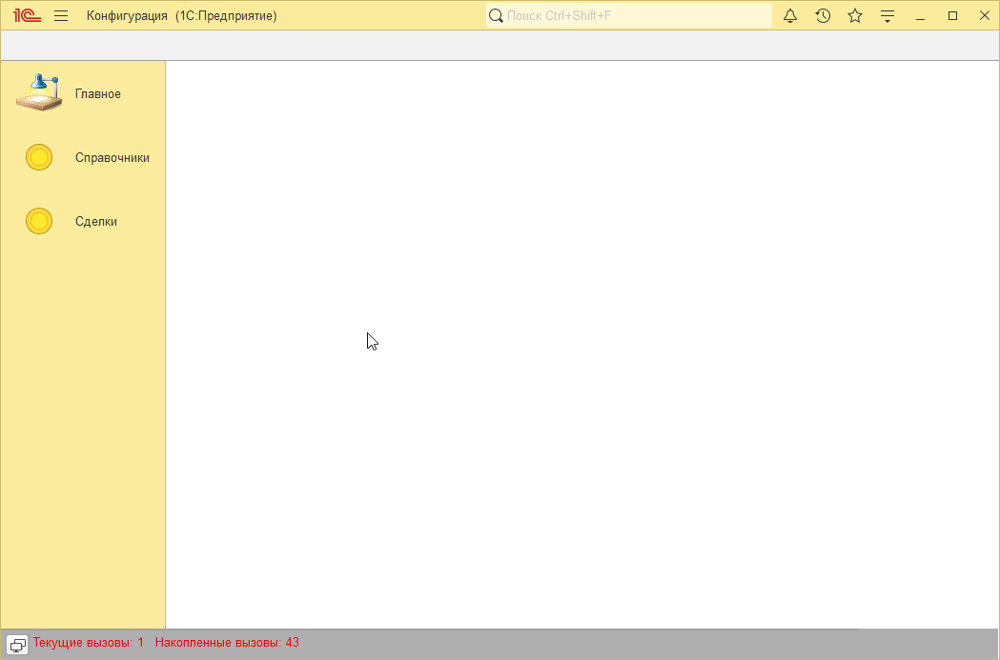

# Пример решения домашнего задания к занятию "Программная работа со Ссылочными типами. Обновление конфигурации"

## Задача 1. Версия конфигурации

   

## Задача 2. Виды контактной информации

   

## Задача 3. Перенос контактной информации справочника Контрагенты в табличную часть.

   

## Задача 4*. Перерасчет документов

   

