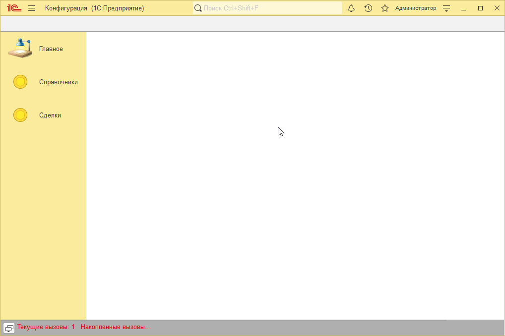
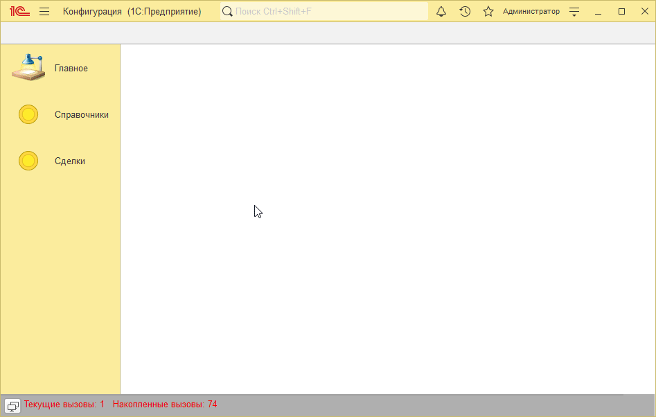

# Пример решения домашнего задания к занятию "Формы списка и выбора"

## Задача 1. Видимость помеченных на удаление элементов списка

   

## Задача 2. Подбор номенклатуры в формы документов

   

## Задача 3*. Блокирование элементов документа Установка цен

   

